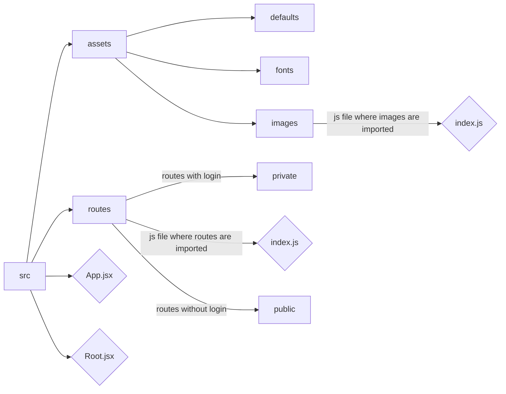
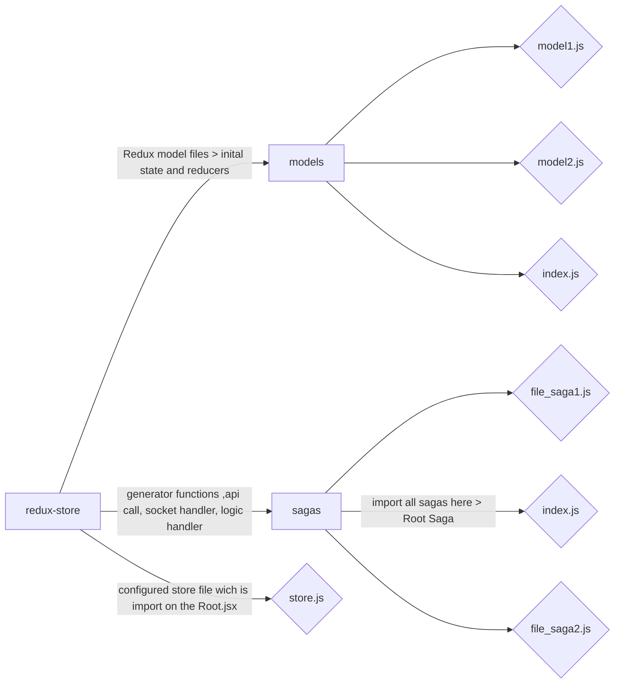
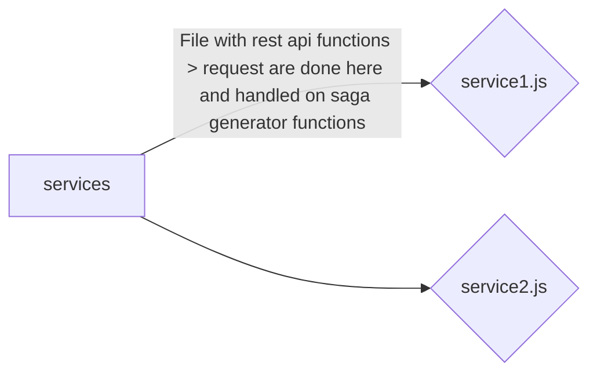

# React Redux Webpack template

    Front end boilderplate configured with react and redux saga.

Script you can execute

1.  **START** "cross-env NODE_PATH=src/ NODE_ENV=development webpack-dev-server --open",
2.  **BUILD** "cross-env NODE_PATH=src/ NODE_ENV=production webpack"
3.  **extract** "Extract language components"
4.  **compile** Compiles .po files (languages) into .js file

## Folder structure >

Entry folder is **src** and with webpack and cross-env you can import on evry file tree directyle from src ex : import Test from 'test/index.js' . (Even if you are deep inside folder treee it searches first from **src**).

Folder Tree ( rectangular[] ->folder ) === (rhombus<> -> file with extension)

## Root folder files

> **.linguirc** (setup all language translation used and select wich folder to include)
> **.prittierrc** (code formatting settings with prettier Extension **esbenp.prettier-vscode** )
> **babel-config.js** (babel plugin for code syntacs to work for older browsers ex:Es7 , proposals, etc)
> **manifest.config.js** (manifest of the website, title favioc descripton keywords etc)
> **paths.js** (js file imported on webpack configs for folder paths)
> **template.html** (Initial html file for the project)

> **webpack files** (webpack plugins and configs for diffrent environments, minification,chunks,import configs)

1.  **weback.common.js** (configuration used on both development and production folder)
2.  **webpack.config.js** (initial webpack config file)
3.  **webpack.dev.js** (configuration used only on development while coding)
4.  **webpack.prod.js** (configuration used only on build production)
